# Server-Client vs. P2P-Modell

i> **P2P/Peer to Peer** und **Server-Client** sind **Netzwerkmodelle**. P2P ist vor allem auf die Konnektivität zwischen Computern spezialisiert, das Server-Client-Modell hingegen wird vor allem zum Datenaustausch verwendet. 

## Server-Client

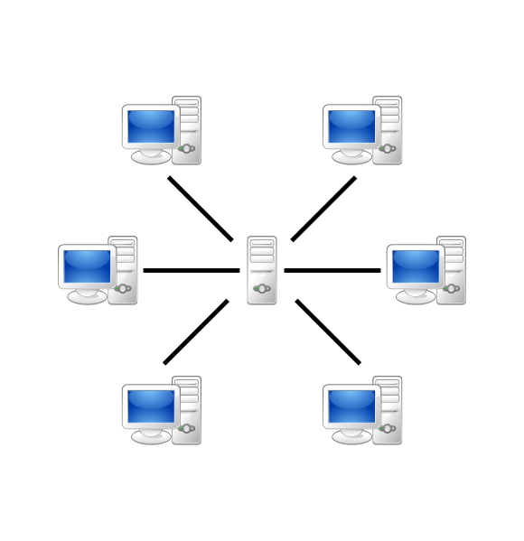

i> In einem Server-Client Netzwerk dient ein Rechner, bzw ein Programm als **Server** (engl. Diener) und die anderen als **Clients** (engl. Kunde). Das Netzwerk ist zentral.

!> Der Begriff Server hat zwei verschiedene Bedeutungen. Zum einen bezeichnet er ein Programm, das bestimmte Dienste bereitstellt, zum Beispiel den Zugriff zu einer Datenbank, E-Mail Verwaltung oder IP-Vergabe (DHCP-Server). Zum anderen bezeichnet Server einfach nur einen Computer, auf dem solche Server laufen.
 
### Vorteile 
 
* Ein zentraler Server erlaubt auch eine zentrale Verwaltung. Updates für die Datenverarbeitung müssen beispielsweise nur auf dem Server installiert werden.
* Durch die lokale Datenspeicherung auf dem Server müssen die Clients selbst weniger Daten speichern.
* Auch die Sicherheit ist für die Clients höher. Sie müssen sich beim Zugriff auf den Server authentifizieren. Bei Angriffen leidet außerdem in der Regel nur der Server.
* Die Anzahl der am Netzwerk beteiligten spielt für den Server keine Rolle. Ein Client kann problemlos mit dem Server verbunden werden, ohne das gesamte Netzwerk zu verändern.
 
### Nachteile

* Der Datentransfer ist immer nur so schnell wie das schwächste Glied. Da in diesem Fall alles über den Server läuft, kann es also schnell zum sogenannten Bottlenecking (Bottleneck engl. Flaschenhals) kommen, wenn der Server mit den Anfragen überlastet ist.
* Um dies zu verhindern braucht man einen leistungsstarken Servercomputer, was in Folge kostenintensiv ist.
* Beim Ausfall des Servers funktioniert gar nichts mehr. Größere Unternehmen haben für diesen Fall mehere Server, die man auch als Fallback (engl. Rückhalt) bezeichnet werden.

### Beispiel: E-Mail

Ein E-Mail-Programm besteht stets aus zwei Teilen. Dem Mailserver und dem E-Mail-Client.

Der Mailserver stellt die E-Mail-Addressen so wie die Vermittlung der E-Mails zur Verfügung. Schickt man nun mit dem E-Mail-Client eine E-Mail, so wird diese an den Server versendet, welcher sie dort abspeichert und eine Empfangsbestätigung zurück sendet.

Wenn der Empfänger dann seine Mails aktualisiert, schickt er eine Anfrage an den Mailserver, ihm alle neuen Mails zu schicken, woraufhin dieser mit den Mails antwortet.
 
## P2P

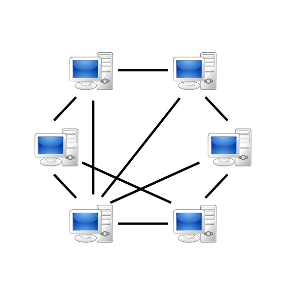

i> Im P2P Netzwerk sind alle Computer sowohl Server als auch Client und werden in diesem Kontext auch als **Nodes** oder **Peers** bezeichnet werden. Das Netzwerk ist dezentral.

### Vorteile

* Fällt eine einzelne Node aus, funktioniert das Netzwerk weiterhin.
* Mit steigender Node-Anzahl steigt auch die Leistung, was P2P billig macht.
* Durch die Selbstorganisation der Nodes benötigt es keinen großen zentralen Managementaufwand.

### Nachteile

* Es ist nicht sofort klar, welche Node welchen Service anbietet, daher muss man entweder einen zentralen Server benutzen, der speichert, welche Node was tut und leitet einen weiter. Alternativ muss man bei allen Nodes einzeln anfragen.
* Da die Verwaltung jeweils beim Betreiber der Node liegt, steigt die Virusgefahr und auch die Netzwerksicherheit ist schwerer zu organisieren.
* Wenn viele Nodes eine andere Node zugleich beanspruchen, kann es schnell zu Performanceeinbrüchen kommen, da in einem P2P-Netzwerk für gewöhnlich normale Heimcomputer als Nodes fungieren. 
* Die eigene IP- und MAC-Addresse liegt jeder Node, die mit einem Verbunden ist, zur Verfügung, was ein Sicherheitsrisiko darstellt.

### Beispiel: Filesharing

P2P erlangte um die Jahrtausendwende große Aufmerksamkeit über den Dienst Napster. Dieser war kein reiner P2P-Server sondern hatte einen zentralen Server. Bei Installation wurde der eigene PC auf MP3-Dateien überprüft und die Informationen über die Verfügbarkeit dieser an den Zentralserver gemeldet.

Ein anderer Nutzer konnte dann beim Server nach bestimmten Musikstücken anfordern, und wurde mit einem Nutzer verbunden, der eine Datei des gefragten Stückes auf seinem Rechner hatte.

(Dieser zentrale Server machte Napster rechtlich angreifbar und der Dienst wurde nach mehreren Klagen der Musikindustrie Mitte 2001 abgeschaltet.)

### Beispiel: Grand Theft Auto Online

Als GTA V 2013 für die Xbox 360 und PlayStation 3 erschien, wären die Bedingungen für Server aufgrund der Ansprüche von Microsoft und Sony, dass ihre Konsolen sich nur mit verifizierten Servern verbinden können, so horrende gewesen, dass Rockstar Games sich dafür entschied, statt einem Server-Client-System auf P2P zurückzugreifen. Server gab es nur fürs Matchmaking und die Authentifizierung.

Dies ist ein gutes Beispiel dafür, wann P2P nicht wirklich angebracht ist. In einer GTA Online-Lobby können bis zu 30 Spieler sein. In Spitzenzeiten muss also jeder einzelne an 29 andere Spieler alle Informationen über Autos, Schüsse, NPCs, ... übertragen. Dadurch kommt es zur 29-fachen Belastung für jeden einzelnen im Gegensatz zu einem Server-Client-System.

Das Ergebnis im Spiel sind sich hin und her teleportierende Autos, einfach so verschwindende NPCs oder auch bei einem selbst als Treffer angezeigte Schüsse, die beim anderen aber verfehlen. Auch sorgt es dafür, dass man selbst aus der Lobby geworfen wird, sobald man die Verbindung zu einem anderen Spieler verliert, schließlich wäre es schwer zu erklären, dass der Spieler für die anderen noch da ist. Ein weiteres riesiges Problem des Spiels sind Hacker bzw. Modder. Da die Spielinformationen unüberprüft an andere geschickt werden, kann man einfach so Autos spawnen oder Treffer einfach nicht als solche wahrnehmen und somit unbesiegbar sein.

Da die neueren Konsolen- sowie die PC-Version lediglich Ports der Old-Gen Konsolenversion sind, gibt es 8 Jahre später immer noch keine Server. 

## Vergleich

| Server-Client | P2P           |
| ------------- | ------------- | 
| Server und Clients sind verschieden     | Server und Client sind gleich. |
| Wird vor allem zum Speichern und Verteilen von Inhalten genutzt    | Wird vor allem zur Kommunikation in Netzwerken verwendet.      |  
| Daten liegen auf einem zentralen Server | Daten liegen auf verschiedenen Geräten |    
| Server stellen nur Dienste bereit; Clients fragen nur Dienste an | Nodes stellen Dienste bereit und fragen Dienste an |
| Wird aufwendiger, desto mehr Nutzer es gibt, höhere Chance auf Bottlenecking | Wird weniger aufwendig, desto mehr Nutzer es gibt, Bottlenecking wird unwahrscheinlicher |
| Durchgehend stabil, daher für große und kleine Netzwerke geeignet | Wird mit steigender Nutzerzahl instabiler, ist daher nur für kleine Netzwere geeignet |

## Aufbau mit Filius

### Server-Client

Baue zuerst ein Server-Client-Netzwerk auf (siehe Abbildung).

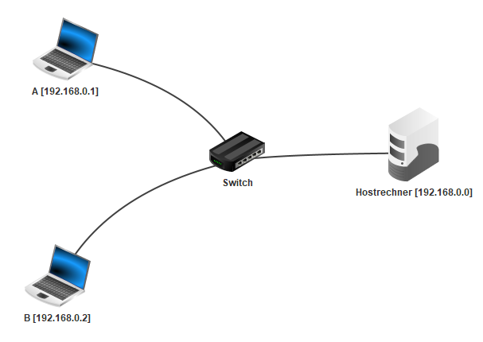

Starte nun die Simulation und installiere das E-Mail-Programm auf A und B sowie den E-Mail-Server auf dem Hostrechner. Öffne nun den E-Mail-Server.

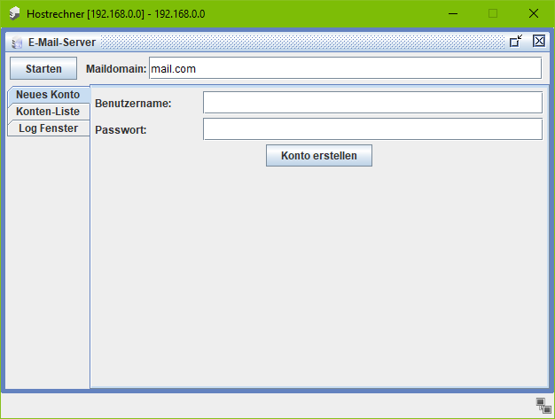

Trage zuerst die Maildomain ein (hier: mail.com). Lege dann ein Konto für A und B an (hier: a/a, b/b). Du kannst die beiden Konten unter Konten-Liste finden. Starte dann den Server und schließe den Hostrechner.

Wähle nun die beiden anderen Rechner.

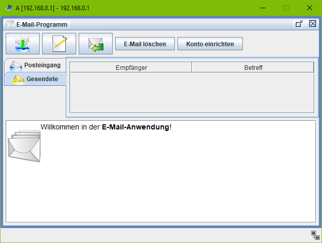

Gehe hier auf Konto einrichten.

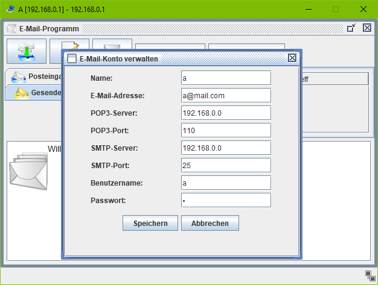

Trage alle Informationen ein. POP3- und SMTP-Server sind beide der Hostrechner. Tu dies auf beiden Rechnern. Gehe dann bei einem der Rechner auf E-Mail verfassen.

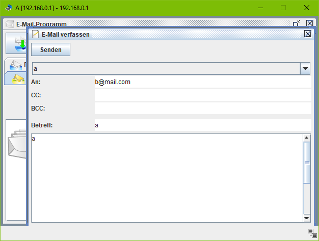

Schicke nun eine E-Mail an die andere E-Mail.Gehe dann am anderen Rechner auf E-Mail abrufen.

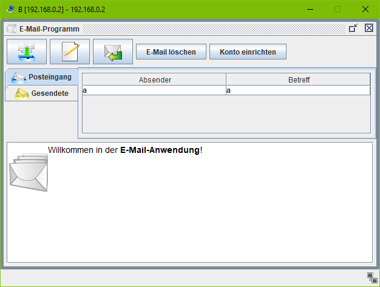

Im Postfach findest du nun die E-Mail.

### P2P

Baue zuerst ein P2P-Netzwerk auf (siehe Abbildung).

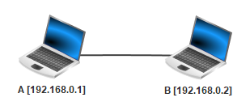

Installiere nun auf A und B Gnutella sowie den Text-Editor auf A. Öffne den Text-Editor und schreibe einen kurzen Text.

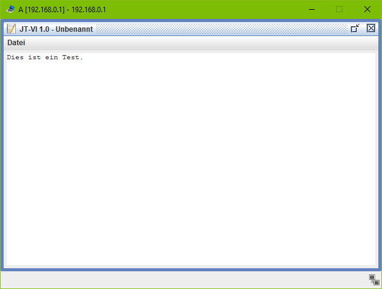

Speichere die Datei im Ordner peer2peer. Öffne nun Gnutella und wähle den Reiter Dateien.

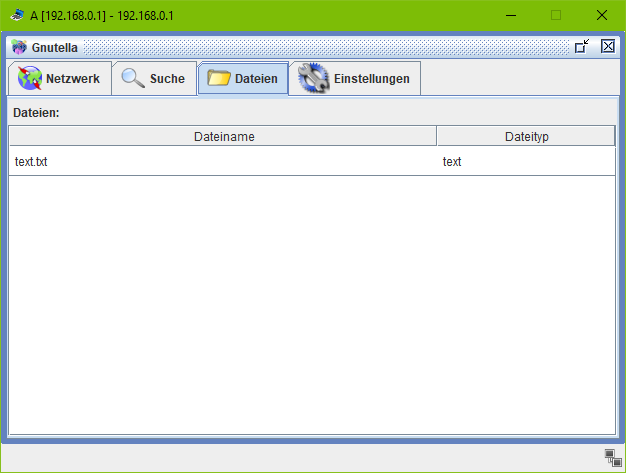

Hier kannst du jetzt die Datei sehen.

Wähle nun B und öffne Gnutella. Gebe unter Netzwerk die IP des anderen Rechners ein und wähle Netzwerk beitreten.

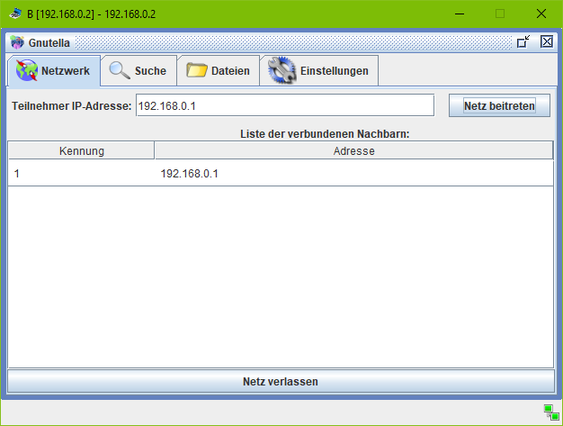

Gehe nun auf den Suche Reiter und gebe einen Suchbegriff ein, um die Datei auf A zu finden.

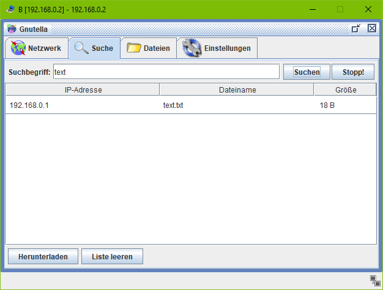

Nun kannst du sie herunterladen.

## Bildquellen
Server-Client-Schema: https://upload.wikimedia.org/wikipedia/commons/thumb/f/fb/Server-based-network.svg/991px-Server-based-network.svg.png

P2P-Schema: https://upload.wikimedia.org/wikipedia/commons/thumb/3/3f/P2P-network.svg/991px-P2P-network.svg.png
